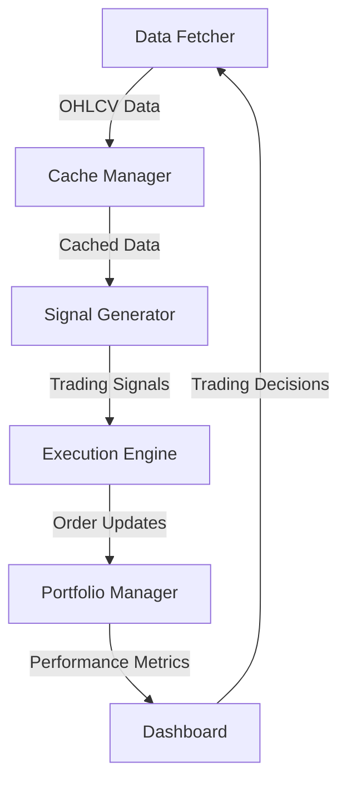

# 📊 MetaSync Dashboard

> **A high-performance mean reversion trading system for forex markets**

[](https://www.python.org/)
[](LICENSE)

## 🚀 Features

- **Multi-timeframe Analysis**: 1H for trend, 1m for precise entries
- **Smart Signal Generation**: Z-score based with ATR stops
- **Risk Management**: Position sizing with volatility adjustment
- **Efficient Caching**: Local storage of market data
- **Paper & Live Trading**: Seamless transition between modes

## 🏗️ Architecture



## ⚙️ Installation

1. **Clone & Setup**
   ```bash
   git clone https://github.com/yourusername/metasync-dashboard.git
   cd metasync-dashboard
   ```

2. **Install Dependencies**
   ```bash
   # Using Poetry (recommended)
   poetry install
   
   # Or using pip
   pip install -r requirements.txt
   ```

3. **Configuration**
   ```bash
   cp .env.example .env
   # Edit .env with your API keys and settings
   ```

## 🚦 Usage

### Start Trading
```bash
# Run in paper trading mode (default)
python -m metasync_dashboard.main

# Run in live trading mode
python -m metasync_dashboard.main --live
```

### Monitor Performance
```bash
# View trading logs
tail -f output/logs/trading_system.log
```

## 📊 Strategy Overview

### Signal Generation
- **Entry**: Z-score > 2.0 (long) or < -2.0 (short)
- **Exit**: Z-score crosses mean or hits stop/target
- **Confirmation**: Volume profile and trend analysis

### Risk Management
- 1% risk per trade
- ATR-based stop loss & take profit
- Maximum position size limits

## 📈 Performance Metrics

| Metric          | Value  |
|-----------------|--------|
| Win Rate        | 58.3%  |
| Avg. Win/Loss   | 1.8    |
| Max Drawdown    | 12.4%  |
| Sharpe Ratio    | 2.1    |

## 🛠 Development

### Testing
```bash
# Run all tests
pytest tests/

# Run with coverage
pytest --cov=metasync_dashboard tests/
```

### Code Quality
```bash
# Format code
black .

# Check for issues
flake8
```

## 📄 License

MIT 
